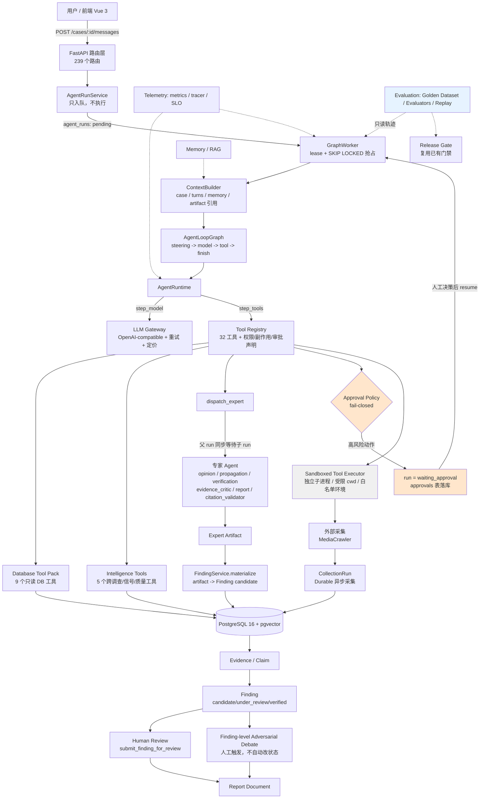

# Architecture — 主链路与边界

> 本图只画**主链路与能力边界**，不铺数据库表（129 张表在图里没有信息量）。
> 所有节点都是当前仓库里的真实实现。

## 主图



## 主链路（一句话版）

```text
用户提问
  → AgentRunService 入队（不执行，保证不阻塞请求）
  → GraphWorker 抢占并执行
  → ContextBuilder 组装上下文（case / 历史 / memory / artifact 引用）
  → AgentLoopGraph 循环：模型决策 → 工具执行 → 再决策
  → 高风险工具触发审批中断（run 停在 waiting_approval）
  → 专家委派产出 artifact，物化为 Finding
  → 人工评审改状态 / 对抗评审给意见
  → 报告绑定证据引用
```

## 辅助能力（模块与位置）

| 能力 | 位置 | 说明 |
|---|---|---|
| Memory / RAG | `infrastructure/database/knowledge_repository.py` | 按 case 隔离的记忆与检索 |
| Approval | `harness/approval_policy.py` | fail-closed 策略引擎 + 工具级声明 |
| Sandbox | `harness/sandbox.py`、`harness/external_tools.py` | 外部工具在独立子进程、受限 cwd、白名单环境执行 |
| Telemetry | `telemetry/`（metrics / tracer / slo） | 进程内指标 + span + 4 条 SLO |
| Evaluation | `app/evaluation/`、`application/evaluation_service.py` | Golden Dataset、10 个 evaluator、Replay、Release Gate |
| Platform Auth | `services/platform_auth.py` | AES-256-GCM 加密凭据 + 服务端扫码登录 |
| A2A 边界 | `a2a/gateway.py` | **本地 A2A 兼容入口**，把 sendTask/getTask 映射到同一套 run 机制 |

## 四个必须讲清楚的边界（防止过度声明）

1. **A2A 是本地兼容边界，不是分布式集群。**
   `a2a/gateway.py` 的 docstring 明确写了 remote gateway 未部署：配置了
   `a2a_remote_url` 时路由返回显式 501，而不是假装可用。正确说法是
   **A2A-compatible integration boundary**。

2. **不是微服务。** 单个 FastAPI 进程内承载 API + GraphWorker；采集由独立的
   durable CollectionRun 承载；ML 能力（embedding / sentiment）通过可选的
   worker HTTP 接口调用，不可用时降级而不是崩溃。

3. **多 Agent ≠ 更多智能。** 专家是按**职责与权限**切的（各自有独立工具白名单），
   不是为了显得"多智能体"。coordinator 能看到的数据面比专家窄，这是有意的。

4. **Debate 不改状态。** 对抗评审产出的是评审意见与证据对抗结论；把 Finding 变成
   `verified` 的唯一路径是人工评审决策。这不是实现偷懒，而是事实责任边界。

## 数据与持久化（只列关键 4 张运行表）

```text
agent_runs   一次 Agent 运行：status / objective / lease / tokens / cost
run_events   运行事件流（SSE 回放的唯一来源，DB 轮询 + cursor）
tool_calls   工具调用轨迹：arguments / result / status / duration / approval_id
model_calls  模型调用指标：tokens / latency / cost / pricing_model
```

Evaluation 侧复用同一套记录，不新建 trace 系统：
`evaluation_runs` 承载 agent 指标（`agent.*`），`release_gates` 承载门禁阈值。
